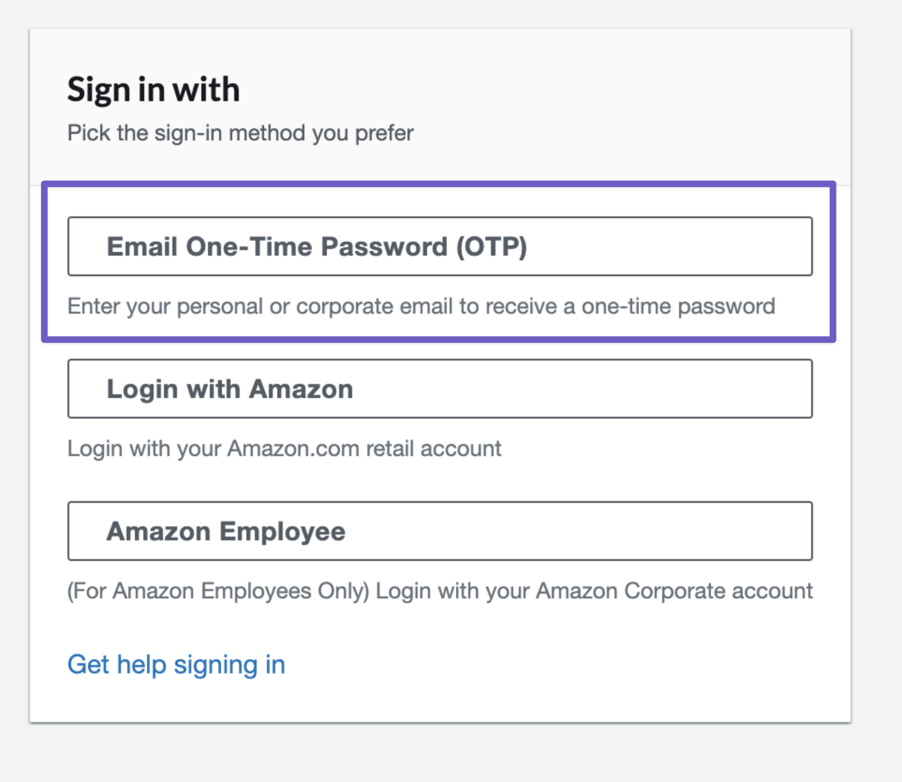
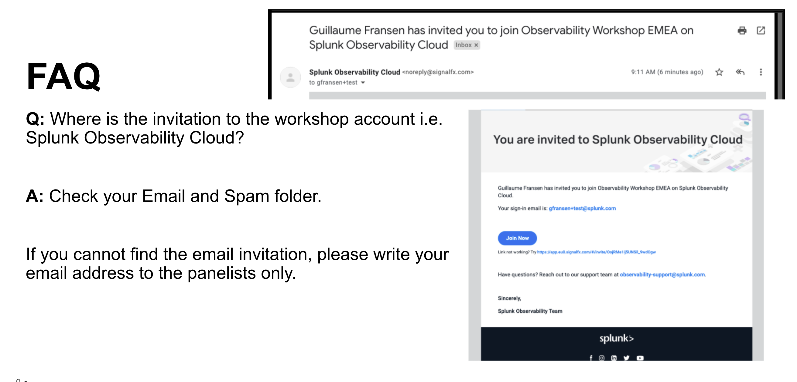
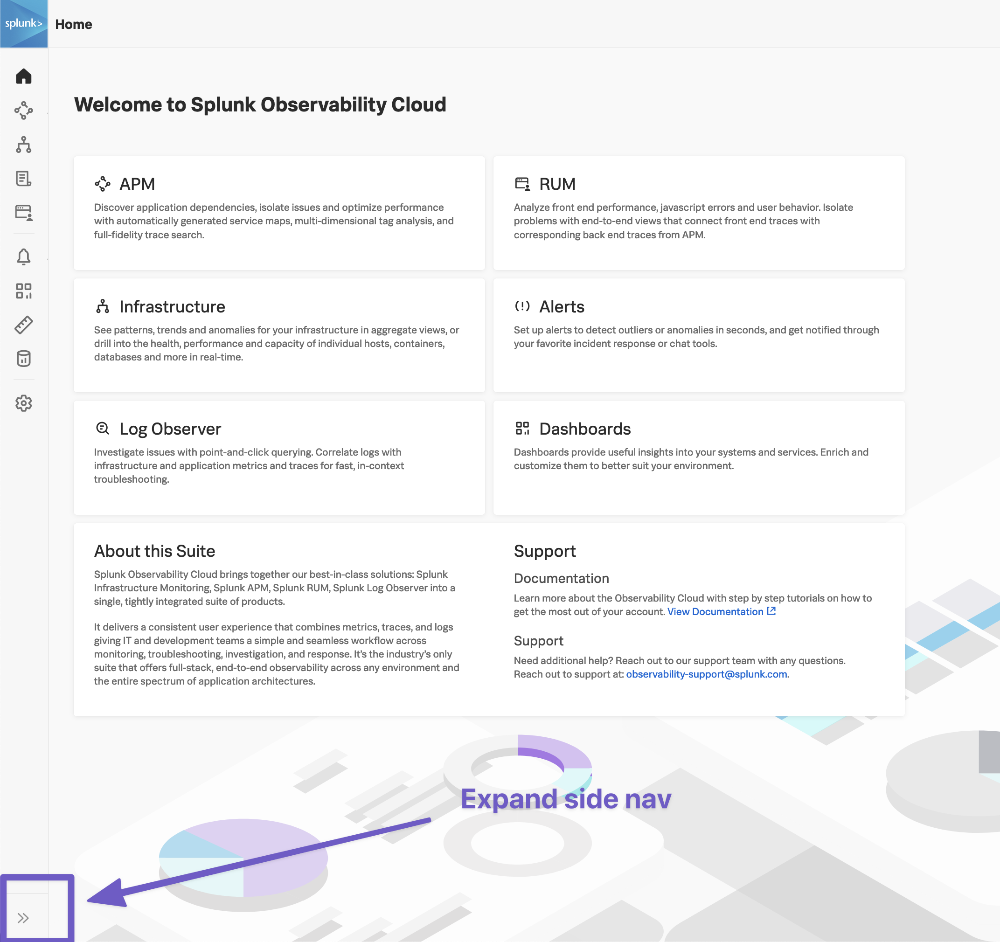
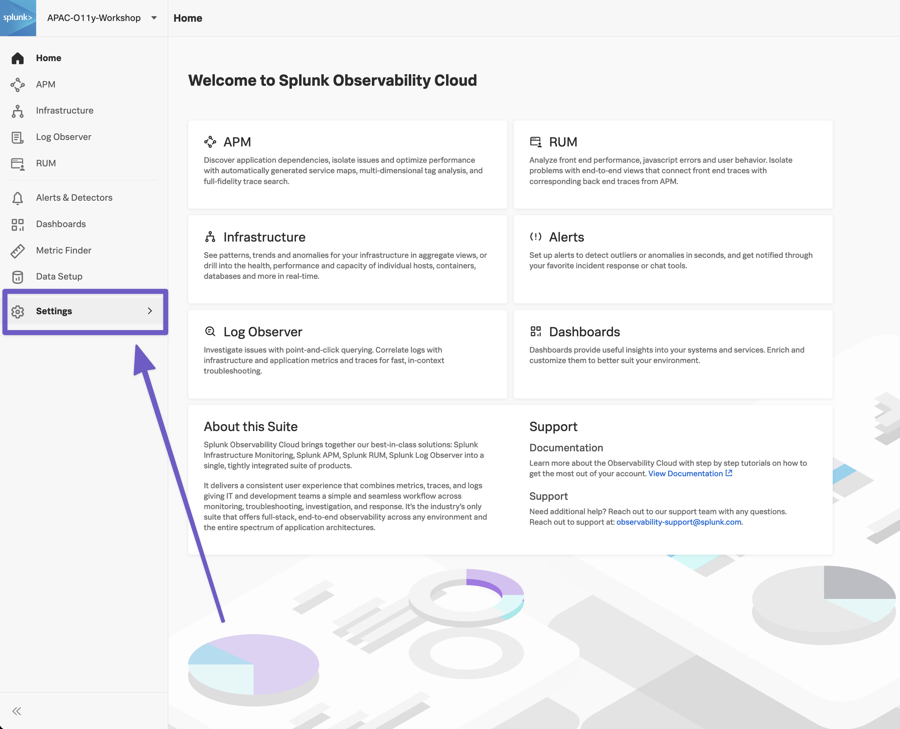
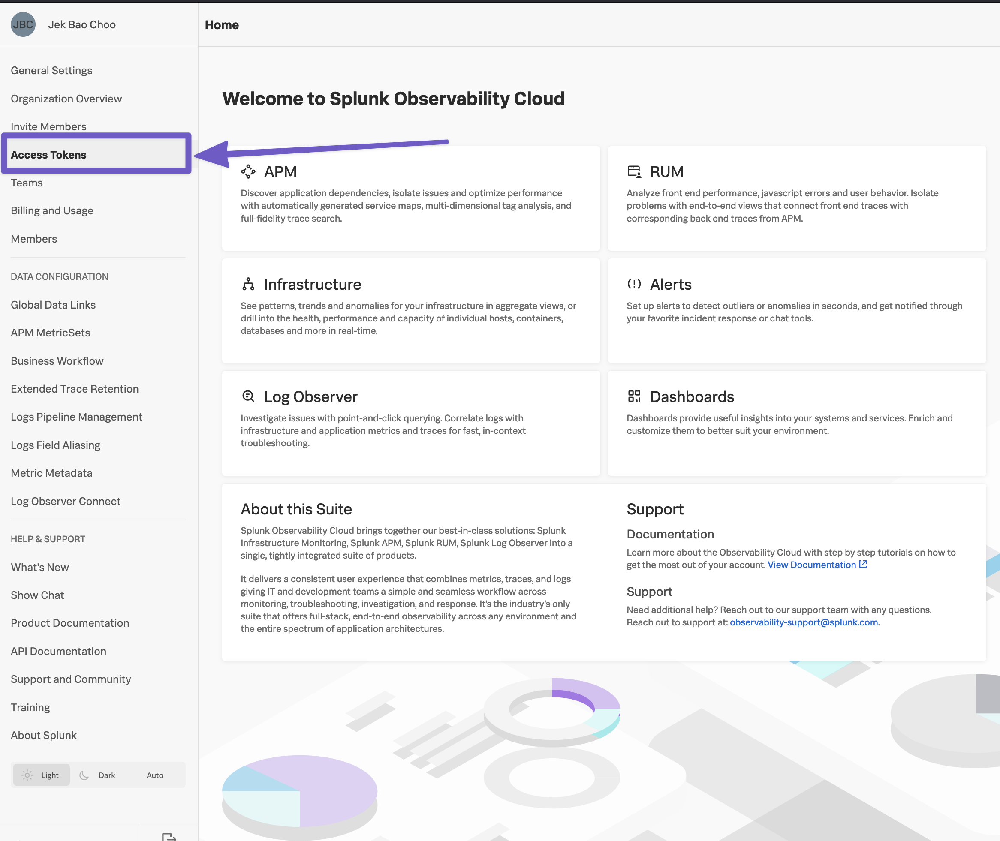

# 14 Steps

##  Step 1
Go to AWS Event Engine at https://dashboard.eventengine.run/login 


Please get the Event Hash from your workshop instructor.

```bash

```

## Step 2

Sign in (to AWS EKS environment) via Email OTP



## Step 3

Select AWS Console


## Step 4

Remember to only use "us-west-2" as your region


## Step 5

Select EC2 from Management Console and select Instances (running). You should see a EC2 instance called SplunkWorkshop-box


## Step 6

Now select SplunkWorkshop instance and select connect


## Step 7

Remember to only use "ap-southeast-1" as your region


## Step 8

Click Connect


## Step 9

Verify that you see the terminal.


## Step 10

Verify EKS cluster. Select EC2 Instance Connect tab and click connect. This will open an SSH session to the EC2 instance. Once the instance is opened check the running EKS cluster. You should see a cluster named
```bash
eksctl get cluster --region us-west-2
```

## Step 11

Update Kubectl
```bash
aws eks --region us-west-2 update-kubeconfig --name eksworkshop-eksctl
```

## Step 12

Test Kubectl
```bash
kubectl get nodes
```
If we see our 2 nodes, we know we have authenticated correctly

## Step 13

Install Helm 3
```bash
curl -fsSL -o get_helm.sh https://raw.githubusercontent.com/helm/helm/master/scripts/get-helm-3
```

---

```bash
chmod 700 get_helm.sh
```

---

```bash
./get_helm.sh
```

## Step 14

Get Workshop content from Splunk Observability repo

```bash
wget https://github.com/signalfx/observability-workshop/archive/refs/heads/master.zip
```

---

```bash
unzip master.zip
```

---

```bash
mv observability-workshop-master workshop
```

# Congratulations
You have completed your AWS EKS cluster setup with the resources for Splunk O11y workshop. Let us get started with the workshop by accessing Splunk O11y portal. 

## Step 15

Access your Splunk O11y portal by going to your email account. We have triggered an invite. 



## Step 16

Once sign in to Splunk O11y portal, expand the side nav. 



## Step 17

Select Settings



## Step 18

Select Access Tokens




# Hooray!
You have achieve a great deal.
- Sign in to AWS EKS
- Set up the workshop resources
- Sign in Splunk Observability 
Take a break; you earned it! 
After the break, let us see the value of Splunk Observability by going to 
https://signalfx.github.io/observability-workshop/v3.14/otel/k3s/
